<div align="center">

# ```> trmxvibs_```


</div>

<p align="center">
  
  
  
</p>

<p align="center">
  <a href="mailto:termuxvibes@gmail.com"></a>
  <a href="https://youtube.com/@termux2"></a>
  <a href="https://github.com/trmxvibs"></a>
</p>

---

### `root@trmxvibs:~# cat about.md`

I build **security research tooling** and **CLI automation frameworks** that make Linux and Termux environments faster to work with — package management, reconnaissance helpers, and workflow automation. Manual, repetitive terminal work should be automated, not memorized.

```bash
$ cat priorities.log
[MAINTAINING]  pkgwrap        → one CLI, 17 package managers
[BUILDING]     Tool-X         → centralized installer, 1000+ security/OSINT tools
[EXPLORING]    subprocess safety, cross-platform CLI design, CI hardening
[NOTE]         all offensive-security tooling here = authorized/lab use only
```

---

### `root@trmxvibs:~# ./scan --visualize`

<div align="center">
  
</div>

<sub align="center">— decorative visualization, not connected to any real network/target —</sub>

---

### `root@trmxvibs:~# ls projects/`

| Project | Description | Stack |
|---|---|---|
| 🧩 **[pkgwrap](https://github.com/trmxvibs/pkgwrap)** | One universal command across apt, pacman, dnf, brew, winget, and more. | `Python` `CLI` |
| ⚡ **[Tool-X](https://github.com/trmxvibs/Tool-X)** | Numeric-ID installer/manager for 1000+ security & OSINT tools on Termux/Linux. | `Bash` `Termux` |
| ✅ **[EnvSanityCheck](https://github.com/trmxvibs/EnvSanityCheck)** | Validates required `.env` variables are present before your app boots. | `Python` `DevOps` |
| 📖 **[termux-commands](https://github.com/trmxvibs/termux-commands)** | A–Z reference of Termux/Linux commands with examples. | `Docs` |

<p align="center">
  <a href="https://github.com/trmxvibs/pkgwrap"></a>
  <a href="https://github.com/trmxvibs/Tool-X"></a>
</p>

---

### `root@trmxvibs:~# neofetch`

<p align="center">
  
  
</p>

<p align="center">
  
</p>

<p align="center">
  
</p>

---

<div align="center">

`root@trmxvibs:~# echo "thanks for stopping by"`

</div>
