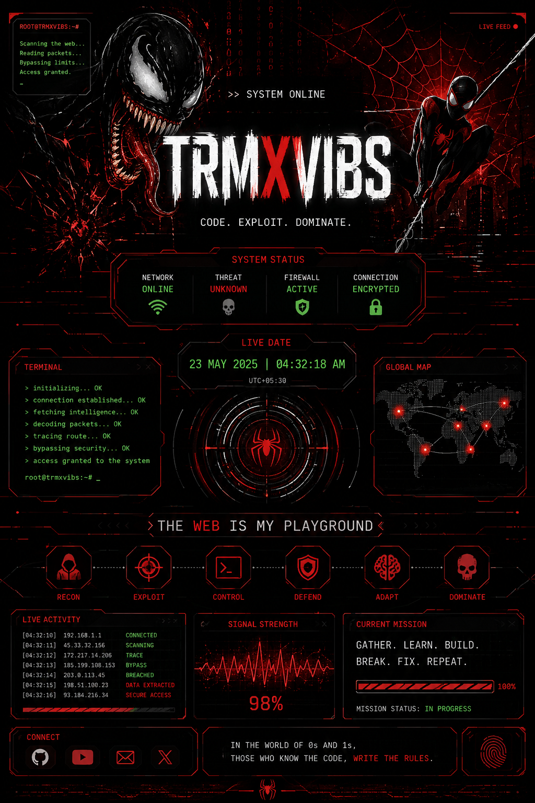

 

  

---

### `THE WEB IS ALIVE.`

`CODE` • `SECURITY` • `SYSTEMS` • `RESEARCH`

 

 

<table align="center">
<tr>
<td align="center">

### 🕷️ WEB

`CONNECTED`

</td>
<td align="center">

### ⚡ CORE

`ONLINE`

</td>
<td align="center">

### 🔴 THREAT

`UNKNOWN`

</td>
<td align="center">

### 🛡️ DEFENSE

`ACTIVE`

</td>
</tr>
</table>

 

  

`RECON` → `ANALYZE` → `BUILD` → `TEST` → `ADAPT`

  

  

### `FOLLOW THE SIGNAL.`

